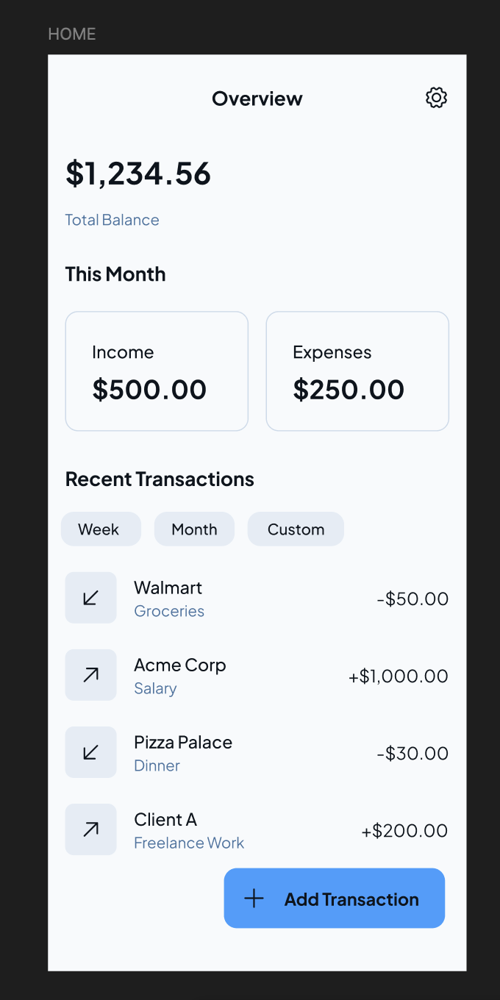
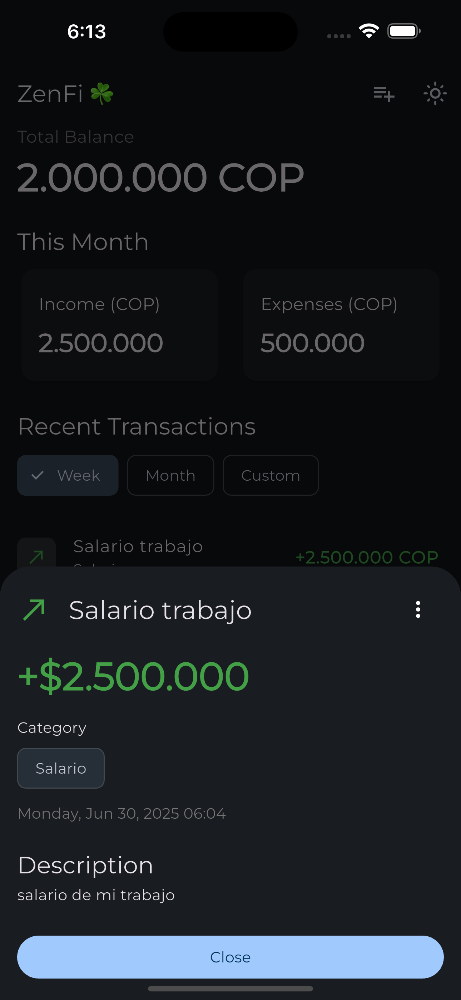
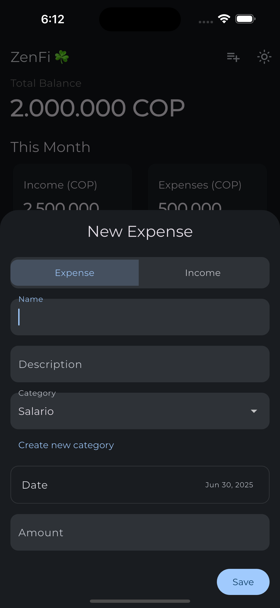
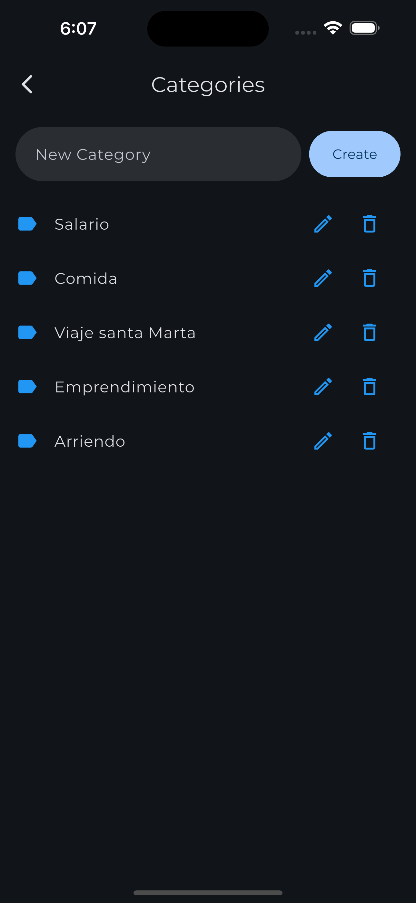
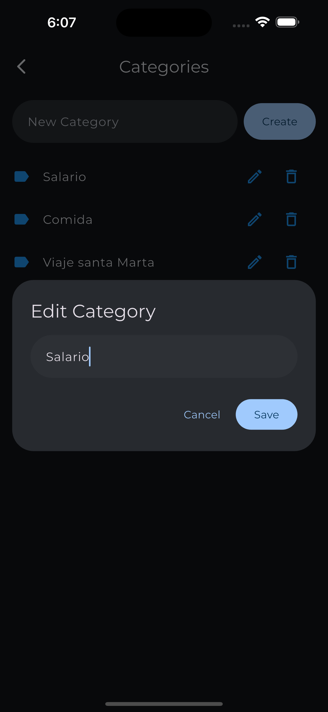
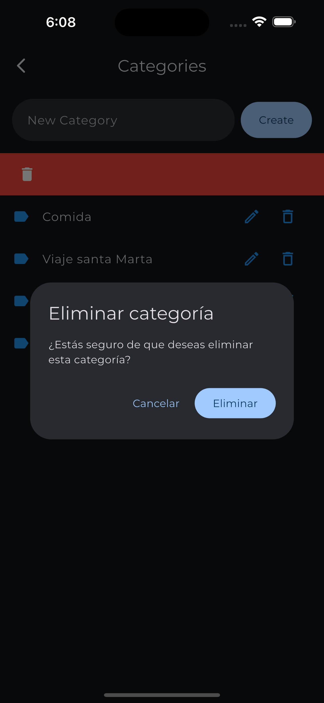

# ZenFi – Gestor de Finanzas Personales

ZenFi es una aplicación móvil para iOS y Android desarrollada en Flutter, diseñada para ayudarte a gestionar tus finanzas personales de manera simple, visual y eficiente. Permite registrar ingresos y gastos, categorizarlos, y visualizar resúmenes claros de tu actividad financiera.

## 🖼️ Capturas de Pantalla

| Pantalla Principal | Detalle de Transacción | Nuevo Movimiento | Gestión de Categorías | Editar Categoría | Eliminar Categoría |
|:------------------:|:---------------------:|:----------------:|:--------------------:|:---------------:|:-----------------:|
|  |  |  |  |  |  |

## ✨ Características Principales

- **Registro de Transacciones**: Añade ingresos o gastos de forma manual, asignando nombre, descripción, monto, fecha y categoría.
- **Gestión de Categorías (CRUD)**: Crea, visualiza, edita y elimina categorías personalizadas para organizar tus movimientos.
- **Dashboard Principal (Resumen):**
  - Visualiza el balance total (ingresos menos gastos históricos).
  - Tarjetas de resumen para ingresos y gastos del mes.
  - Lista de transacciones recientes.
- **Filtrado de Transacciones**: Filtra la lista y los resúmenes por semana, mes o rango de fechas personalizado.
- **Detalle y Edición de Transacciones**: Consulta los detalles de cada movimiento, edítalo o elimínalo fácilmente.
- **Tema Claro y Oscuro**: Cambia entre modos de visualización para una mejor experiencia.

## 🏗️ Arquitectura

ZenFi sigue una **Arquitectura Limpia** para garantizar un código desacoplado, escalable y mantenible. Las capas principales son:

- `domain`: Lógica de negocio pura, entidades (`Transaction`, `Category`) e interfaces de repositorios.
- `infrastructure`: Implementaciones concretas de los repositorios y acceso a la base de datos local (Isar).
- `presentation`: UI, pantallas (Widgets) y gestión de estado (Provider).
- `config`: Configuración transversal: inyección de dependencias (`get_it`), enrutamiento (`go_router`) y tema visual.

## 🛠️ Stack Tecnológico

- **Framework:** [Flutter](https://flutter.dev/)
- **Gestor de Estado:** [provider](https://pub.dev/packages/provider)
- **Base de Datos Local:** [Isar](https://pub.dev/packages/isar)
- **Enrutamiento:** [go_router](https://pub.dev/packages/go_router)
- **Inyección de Dependencias:** [get_it](https://pub.dev/packages/get_it)
- **Tipografía:** [google_fonts](https://pub.dev/packages/google_fonts)

## 🚀 Cómo empezar

1. **Clona el repositorio:**
   ```sh
   git clone https://github.com/tu-usuario/expenses_app.git
   cd expenses_app
   ```
2. **Instala las dependencias:**
   ```sh
   flutter pub get
   ```
3. **Genera el código para Isar:**
   ```sh
   dart run build_runner build
   ```
4. **Ejecuta la aplicación:**
   ```sh
   flutter run
   ```

## 📱 Compilación Android

### Problemas Conocidos y Soluciones

Si experimentas errores durante la compilación en Android relacionados con el **namespace de Isar**, consulta la documentación específica:

📖 **[Guía de Fix para Namespace de Isar](ISAR_NAMESPACE_FIX.md)**

Este documento contiene:
- ✅ Diagnóstico del problema con Android Gradle Plugin 8.0+
- 🔧 Soluciones paso a paso  
- 🚀 Script automático para aplicar el fix
- 👥 Instrucciones para el equipo de desarrollo

### Compilación Rápida

```sh
# Limpia el proyecto
flutter clean

# Reinstala dependencias
flutter pub get

# Si hay problemas con Isar namespace, ejecuta:
./fix_isar_namespace.sh

# Compila para Android
flutter build apk --debug
```

## 📁 Estructura del Proyecto

```
lib/
├── main.dart                 # Punto de entrada de la app
│
├── config/
│   ├── di/
│   │   └── service_locator.dart # Inyección de dependencias
│   ├── router/
│   │   └── app_router.dart      # Configuración de rutas
│   └── theme/
│       └── app_theme.dart       # Tema visual
│
├── domain/
│   ├── entities/
│   ├── enums/
│   ├── repositories/         # Interfaces (contratos)
│   └── use_cases/            # Lógica de negocio
│
├── infrastructure/
│   ├── datasources/
│   │   └── isar_datasource.dart # Acceso a Isar DB
│   ├── models/                  # Modelos para Isar
│   └── repositories/            # Implementaciones
│
└── presentation/
    ├── providers/             # Gestores de estado
    ├── screens/               # Pantallas principales
    └── widgets/               # Widgets reusables
```

## 📬 Contacto

¿Tienes sugerencias, dudas o quieres contribuir? ¡Abre un issue o pull request!
